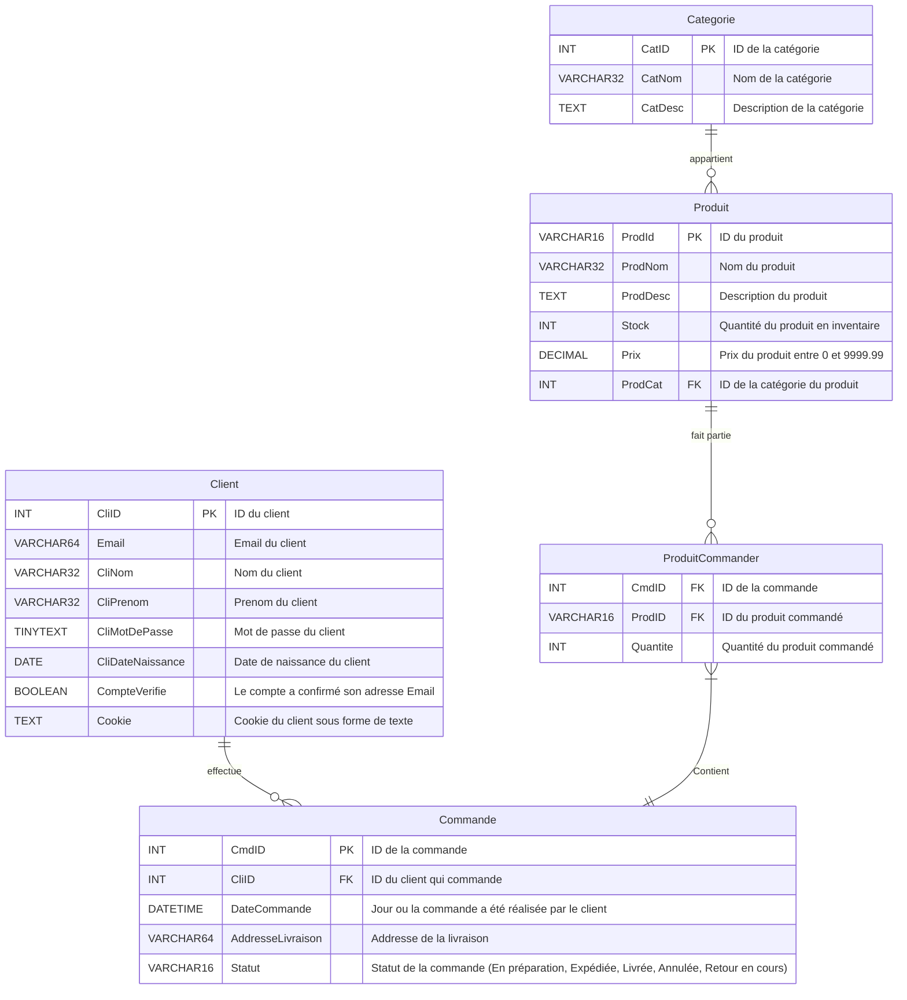

# Diagrame BDD :

### Lecture Diagrame BDD :

| Symbole Gauche | Symbole Droit | Sens                |
| -------------- | ------------- | ------------------- |
| \|o            | o\|           | Zéro ou 1           |
| \|\|           | \|\|          | Uniquement 1        |
| \}o            | o\{           | Zéro ou plus (0..*) |
| \}\|           | \|\{          | Un ou plus (1..*)   |

Source : https://mermaid-js.github.io/mermaid/#/entityRelationshipDiagram
