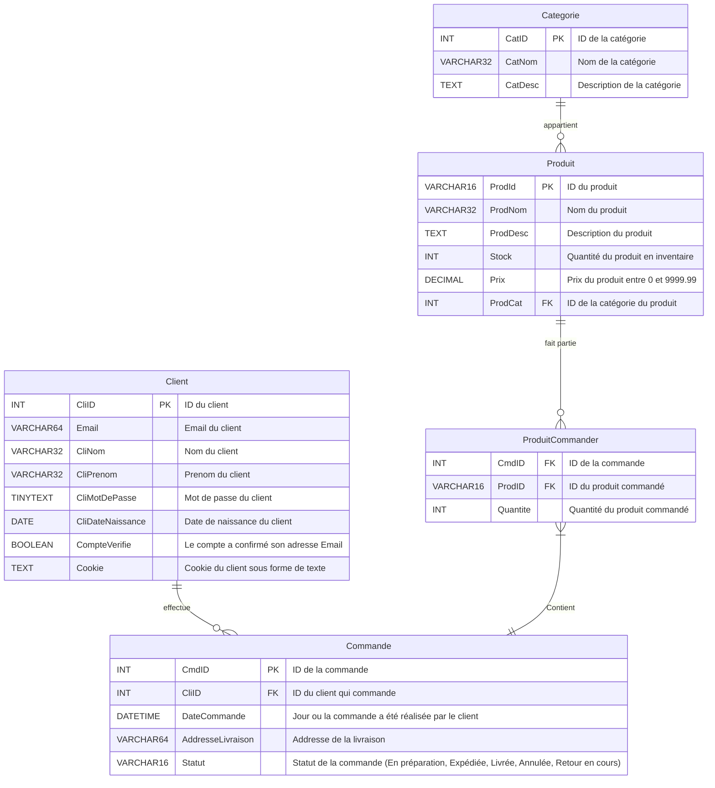

# Rendu SAE :

Les diagrammes sur ce document sont réalisés avec [Mermaid](https://mermaid.js.org/) , voici ci dessous un tableau de lecture et la documentation nécessaire :

### Lecture Diagrame BDD :

| Symbole Gauche | Symbole Droit | Sens                |
| -------------- | ------------- | ------------------- |
| \|o            | o\|           | Zéro ou 1           |
| \|\|           | \|\|          | Uniquement 1        |
| \}o            | o\{           | Zéro ou plus (0..*) |
| \}\|           | \|\{          | Un ou plus (1..*)   |

Source : [Mermaid - ER diagram](https://mermaid-js.github.io/mermaid/#/entityRelationshipDiagram)

# Diagrame BDD :



# Contraintes / Triggers :

## Glossaire des erreurs :

### Erreur SQL :

| SQLSTATE : | Message                                                  |
| ---------- | -------------------------------------------------------- |
| 45001      | Email déjà enregistrer                                   |
| 45002      | Problème de Stock                                        |
| 45003      | Prix trop faible                                         |
| 45004      | Suppresion d'un produit en cours de commande             |
| 45005      | Commande avec compte non verifé                          |
| 45006      | modification du produit (ID) commander dans une commande |

#### InsertClient :

Lors de la création d'un compte client on s'assure que l'email n'est pas déjà renseigné dans la base de donnée.

```sql
CREATE OR REPLACE TRIGGER InsertClient
    BEFORE INSERT
    ON Client
    FOR EACH ROW
BEGIN
    IF EXISTS(SELECT * FROM Client where Client.Email = NEW.Email) THEN
        SIGNAL SQLSTATE '45001' SET
            MESSAGE_TEXT = 'Email deja enregister';
    end if;
END;
```

### UpdateClient

Quand on modifies les informations client on vérifie deux choses :

* Que son nouvel Email n'est pas déjà renseigné par un autre client

* S'il change d'Email il doit le faire vérifier

```sql
CREATE OR REPLACE TRIGGER UpdateClient
    BEFORE UPDATE
    ON Client
    FOR EACH ROW
BEGIN
    IF EXISTS(SELECT * FROM Client where Client.Email = NEW.Email) THEN
        SIGNAL SQLSTATE '45001' SET
            MESSAGE_TEXT = 'Email déjà enregister';
    ELSEIF OLD.Email != NEW.Email THEN
        UPDATE Client c SET c.CompteVerifie = FALSE WHERE c.Email = OLD.Email;
    end if;    
END;
```

### InsertProduit / UpdateProduit

Quand on ajoute ou modifie un produit, on s'assure de ne pas l'avoir un stock ou un prix négatif

```sql
CREATE OR REPLACE TRIGGER InsertProduit
    BEFORE INSERT
    ON Produit
    FOR EACH ROW
BEGIN
    IF NEW.Stock < 0 THEN
        SIGNAL SQLSTATE '45002' SET
            MESSAGE_TEXT = 'Stock initial inférieur à 0';
    end if;
    IF NEW.Prix < 0 THEN
        SIGNAL SQLSTATE '45003' SET
            MESSAGE_TEXT = 'Prix initial trop faible';
    end if;
END;

CREATE OR REPLACE TRIGGER UpdateProduit
    BEFORE UPDATE
    ON Produit
    FOR EACH ROW
BEGIN
    IF NEW.Stock < 0 THEN
        SIGNAL SQLSTATE '45002' SET
            MESSAGE_TEXT = 'Nouveau Stock inférieur à 0';
    end if;
    IF NEW.Prix < 0 THEN
        SIGNAL SQLSTATE '45003' SET
            MESSAGE_TEXT = 'Nouveau Prix trop faible';
    end if;
END;
```

### deleteProduit

Lors de la suppression d'un produit on s'assure qu'il n'est pas dans une commande.
Si on veut juste empecher d'autre client de le commander il suffit de le mettre dans une catégorie dédiée.

```sql
CREATE OR REPLACE TRIGGER DeleteProduit
    BEFORE DELETE
    ON Produit
    FOR EACH ROW
BEGIN
    IF EXISTS(SELECT * FROM ProduitCommander pc where pc.ProdID = OLD.ProdID)
    THEN
        SIGNAL SQLSTATE '45004' SET
            MESSAGE_TEXT = 'Ce produit est dans une commande, il ne peut pas être supprimer';
    end if;
end;
```

### CreeCommande

Seuls les clients vérifiés peuvent commander

```sql
CREATE OR REPLACE TRIGGER CreeCommande
    BEFORE INSERT
    ON Commande 
    FOR EACH ROW
BEGIN
    IF (SELECT c.CompteVerifie FROM Client c WHERE NEW.CliID = c.CliID) = FALSE THEN
        SIGNAL SQLSTATE '45004' SET
            MESSAGE_TEXT = 'Impossible de commander avec un compte non vérifié';
     end if;
end;
```

### ProduitCommander Insert :

Lors de l'ajout d'un produit à une commande on vérifie bien qu'on ajoute une quantité supérieure à 0 et que le stock d'un produit donné soit suffisant.

```sql
CREATE OR REPLACE TRIGGER ProduitCommanderInsert
    BEFORE INSERT
    ON ProduitCommander
    FOR EACH ROW
BEGIN
    IF NEW.Quantite < 1 THEN
        SIGNAL SQLSTATE '45002' SET
            MESSAGE_TEXT = 'Impossible de commander une quantité négative ou nulle';
    ELSEIF (SELECT p.Stock FROM Produit p WHERE  p.ProdID = NEW.ProdID) < NEW.Quantite THEN
        SIGNAL SQLSTATE '45002' SET
            MESSAGE_TEXT = 'Stock insuffisant';
    ELSE
        UPDATE Produit p SET p.Stock = p.Stock - NEW.Quantite WHERE p.ProdID = NEW.ProdID;
    end if;
end;
```


