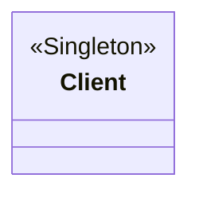
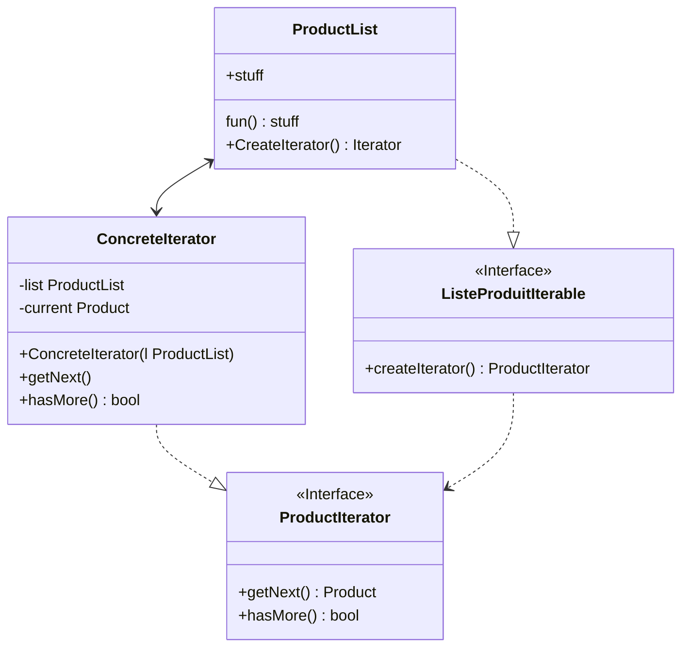
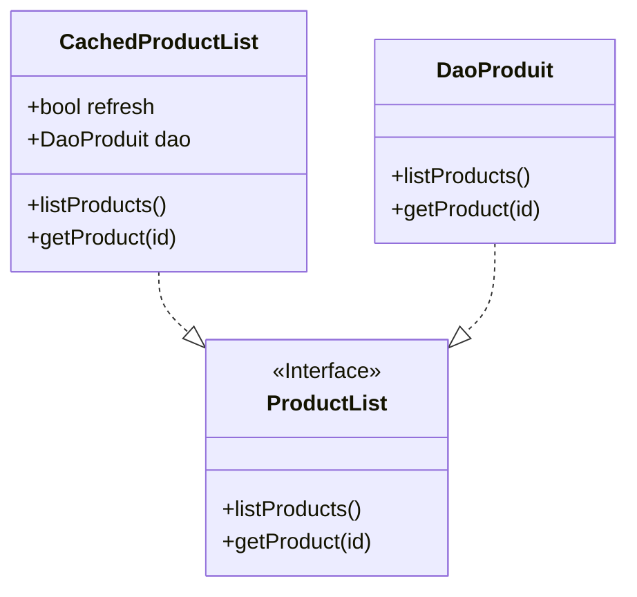

# Patern Singleton (Patern vu en cours) :

#### Source :

[RefactoringGuru -Singleton](https://refactoring.guru/design-patterns/singleton)

#### Objectif :

Rendre la classe client singleton. 
Le fait d'avoir un seul objet client permettera de renforcer la sécurité des données et éviter les situations de session conflictuelles.

#### Outils :

Procédure sur la BD pour check le mot de passe et changer les attributs du client pour éviter d'en générer un nouveau

#### plan :

Crée un client au moment du login et le suprimer a la déconexion.
Le constructeur pourrat être appeler via une requète a la BDD

#### Schema :

# Patern Itérateur (Patern vu en cours) :

#### Source :

[RefactoringGuru -Iterator](https://refactoring.guru/design-patterns/iterator)

#### Objectif :

Rendre la liste produit itérable de différente façons (Par prix,etc...)

#### Outils :

Interface PHP et algorithime de tri

### Plan :

Crée une interface liste de produit et des itérateurs pour aficher les produits de manière différente.

### Schema :

# Patern Proxy :

#### Source :

[RefactoringGuru - Proxy](https://refactoring.guru/design-patterns/proxy)

#### Objectifs :

Eviter les réquétes lourdes sur la BDD.

#### Outils :

Cacher les produits quand leurs stock est suffisement grand / Quand le stock n'est pas important pour eviter d'actualiser la liste a chaque rafraichisement de page.

Crée un classe produit simple qui contient juste des infos simple ( ID +Nom + Prix par exemple ) pour utiliser dans les cas ou ce sont les seuls info utiles. (Produit simple)

### Schema :

