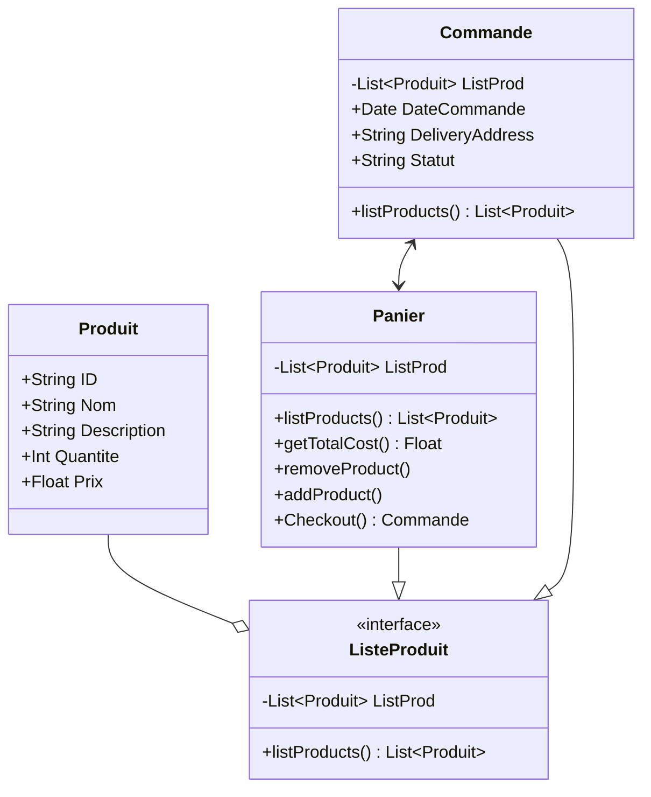
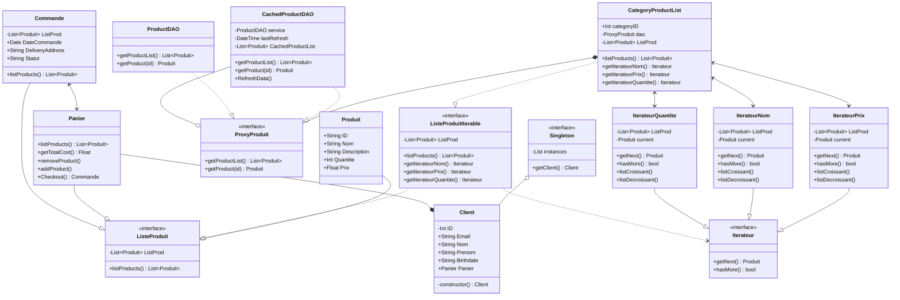

# Code de base sans patern :

```mermaid
classDiagram

%% Base classes 
Produit --o ListeProduit

class Produit {
    +String ID
    +String Nom
    +String Description
    +Int Quantite
    +Float Prix
}

class ListeProduit {
    <<interface>>
    -List~Produit~ ListProd
    +listProducts() List~Produit~
}

Panier --|> ListeProduit
Commande  --|> ListeProduit
Commande  <--> Panier

class Panier {
    -List~Produit~ ListProd
    +listProducts() List~Produit~
    +getTotalCost() Float
    +removeProduct()
    +addProduct()
    +Checkout() Commande
}

class Commande {
    -List~Produit~ ListProd
    +listProducts() List~Produit~
    +Date DateCommande
    +String DeliveryAddress
    +String Statut

}
```

# Diagrame Final :

```mermaid
classDiagram

%% Base classes 
Produit --o ListeProduit

class Produit {
    +String ID
    +String Nom
    +String Description
    +Int Quantite
    +Float Prix
}

class ListeProduit {
    <<interface>>
    -List~Produit~ ListProd
    +listProducts() List~Produit~
}

ListeProduitIterable ..|> ListeProduit
CategoryProductList ..|> ListeProduitIterable

class CategoryProductList {
    +Int categoryID
    -ProxyProduit dao
    -List~Produit~ ListProd
    +listProducts() List~Produit~
    +getIterateurNom() Iterateur
    +getIterateurPrix() Iterateur
    +getIterateurQuantite() Iterateur
}

%% Proxy Patern
CategoryProductList *-- ProxyProduit
CachedProductDAO ..|> ProxyProduit
ProductDAO ..|> ProxyProduit
CachedProductDAO --o ProxyProduit


class ProxyProduit {
    <<interface>>
    +getProductList() List~Produit~
    +getProduct(id) Produit
}


class CachedProductDAO {
    -ProductDAO service 
    -DateTime lastRefresh
    -List~Produit~ CachedProductList
    +getProductList() List~Produit~
    +getProduct(id) Produit
    +RefreshData()
}

class ProductDAO {
    +getProductList() List~Produit~
    +getProduct(id) Produit
}

%% Iterator patern

IterateurPrix --|> Iterateur
IterateurNom --|> Iterateur
IterateurQuantite --|> Iterateur

CategoryProductList <--> IterateurNom
CategoryProductList <--> IterateurPrix
CategoryProductList <--> IterateurQuantite
ListeProduitIterable ..> Iterateur

class ListeProduitIterable {
    <<interface>>
    -List~Produit~ ListProd
    +listProducts() List~Produit~
    +getIterateurNom() Iterateur
    +getIterateurPrix() Iterateur
    +getIterateurQuantite() Iterateur
}

class Iterateur {
    <<interface>>
+getNext() Produit
    +hasMore() bool
}

class IterateurPrix {
    -List~Produit~ ListProd
    -Produit current
    +getNext() Produit
    +hasMore() bool
    +listCroissant()
    +listDecroissant()
}

class IterateurNom {
    -List~Produit~ ListProd
    -Produit current
    +getNext() Produit
    +hasMore() bool
    +listCroissant()
    +listDecroissant()

}

class IterateurQuantite {
    -List~Produit~ ListProd
    -Produit current
    +getNext() Produit
    +hasMore() bool
    +listCroissant()
    +listDecroissant()
}


%% Singleton

Singleton o-- Client

class Singleton {
    <<interface>>
    -List<Singleton> instances
    +getClient() Client
}

class Client {
    -constructor() Client
    -Int ID
    +String Email
    +String Nom
    +String Prenom
    +String Birthdate
    +Panier Panier
}

Panier --|> ListeProduit
Commande  --|> ListeProduit
Commande  <--> Panier
Panier --* Client

class Panier {
    +listProducts() List~Produit~
    +getTotalCost() Float
    +removeProduct()
    +addProduct()
    +Checkout() Commande
}

class Commande {
    -List~Produit~ ListProd
    +listProducts() List~Produit~
    +Date DateCommande
    +String DeliveryAddress
    +String Statut

}
```
