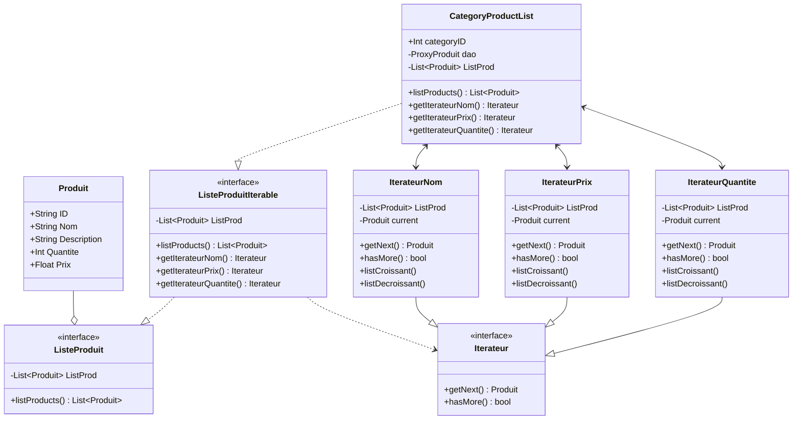

# Patern de développement : **Iterateur**

L'iterateur a pour but d'aider a naviguer de divers façons dans des donées complexes.

###### Application dans notre site :

On veut pouvoir trier facilement les produits dans les catégories pour cela on va crée des itérateurs qui vont permettre de naviguer facilement a travers les donées. 
On ne permet le trie uniquement dans les catégories car il n'a pas grande pertinence a trier le panier / la commande. 

