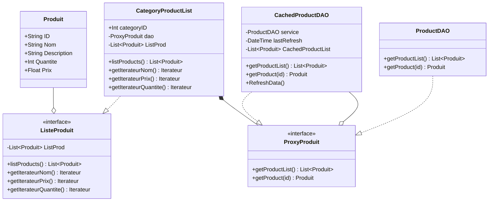

# Patern de développement : Proxy

Le proxy a pour but de limiter les appels à la base de donées, pour cela on utilise un "cache".

###### Application dans notre site :

On veut limiter le nombre de fois que l'on liste tout les produits d'un catégories. 

Pour cela on a un objet appeler **CatagoryProductList** qui quand il crée contient une liste vide quand on lui demande de liter les produits il demande à son proxy *ProxyProduit* qui peut être de deux type :

* CachedProductDAO

* ProductDAO

ProductDAO remplit la liste à l'aide de la base de donées mais le type que nous allons utiliser est le **CachedProductDAO** qui met en cache les donées et les recharges depuis la BBD uniquement si elle sont trop datée ou si on lui demande.

