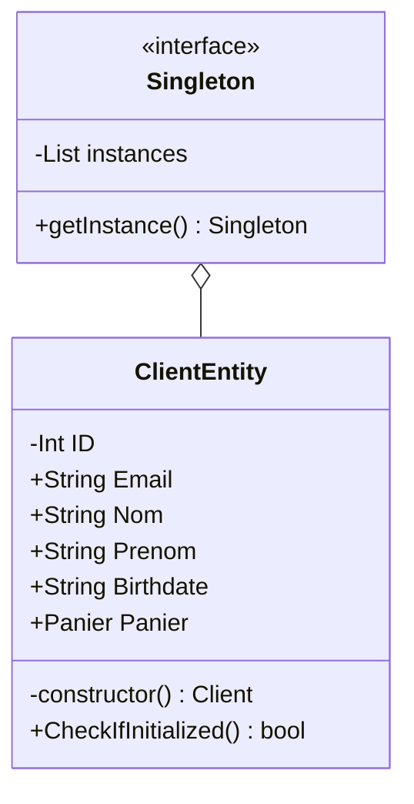
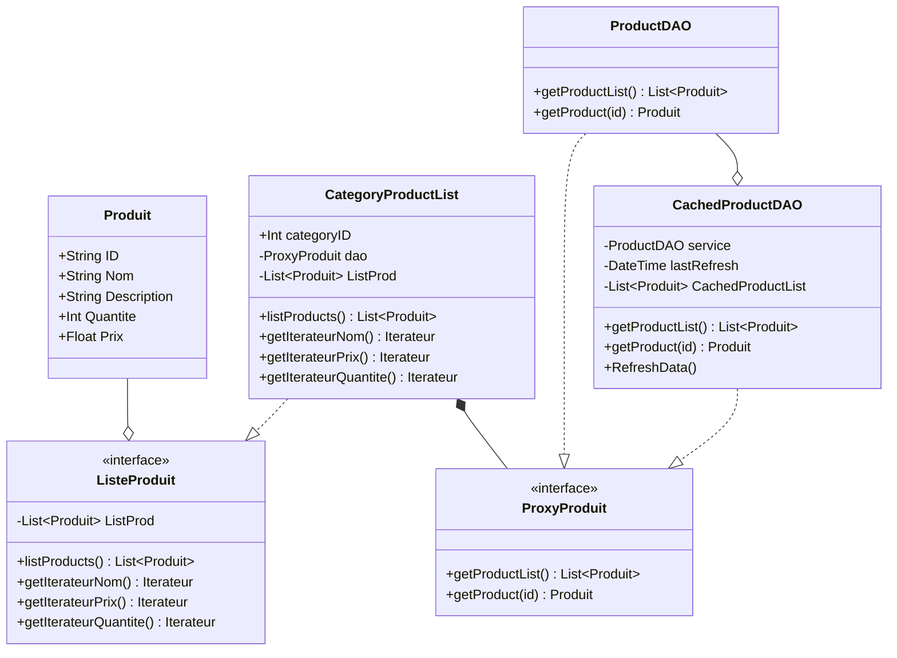
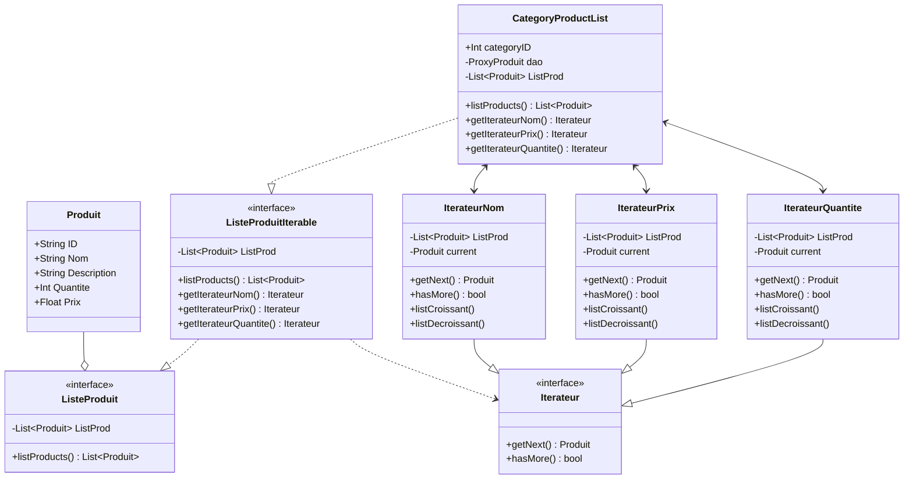

# Patern de dévelopement :

!! Ce document utilise des diagrames générer avec [MERMAID]([Class diagrams | Mermaid](https://mermaid.js.org/syntax/classDiagram.html)) des captures d'écran seront fournies mais il est recommander d'utiliser un editeur supportant ce format !!

## Singleton :

Pour éviter la duplication d'objets client et se protéger de risque de conflits de session (plusieur objets client présents), nous avons implementé le patern singleton :

En PHP il n'y a pas de structure préconstruite pour faire un singleton donc il faut implémenter un classe singleton qui empéche la dupplication d'instances de la class `ClientEntity`

On peut donc récuperer l'unique instance en faisant : 

```php
$client = ClientEntity::getInstance();
```



## Proxy :

Nous voulons limiter le nombre de requettes effectuées à la base de donnée sans compromettre l'expèrience utilisateur·ice.
Lorsqu'un·e utilisateur·ice regarde des produits dans une catégorie il est inutile de la recharger à chaque visite.
Nous avons donc mis en place le patern Proxy qui nous permet de stocker les produits dans un cache.



## Iterateur :

Pour permettre aux clients de trier les produits dans l'ordre qu'iel désire nous avons besoin d'un moyen de parcourir la structure de donnée produit.
Nous afaisons appel au patern itérateur.
Créer plusieurs itérateurs pour traverser `CategoryProductList` nous evitera de devoir trier la liste plusieurs fois.


