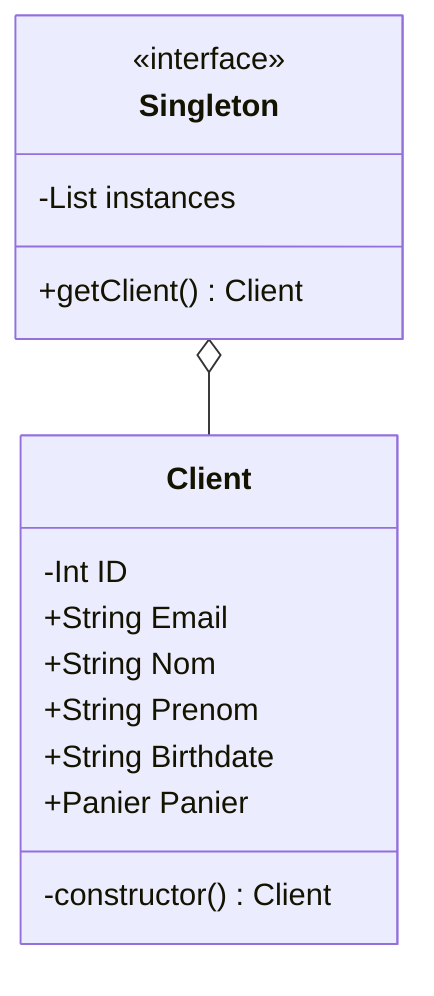

# Patern de développement : **Singleton**

L'objectif du singleton est de limiter l'instance d'une classe à une seule.

###### Application dans notre site :

On veut limiter le client a une seule instance pour éviter les risques de sécurité et les problèmes de développement / de cookies.



```php
<?php

class Singleton {
    private static instances = [];
    protected function __construct() {}
    protected function __clone() {}
    public function __wakeup()
    {
        throw new \Exception("Cannot unserialize singleton");
    }
    public static function getInstance()
    {
        $subclass = static::class;
        if (!isset(self::$instances[$subclass])) {
            self::$instances[$subclass] = new static();
        }
        return self::$instances[$subclass];
    }

}

class Client extends Singleton {
    private $CliID
    public $Email
    public $Nom
    public $Prenom
    public $DateDeNaissance
    public $Panier

    protected function __construct()
    {
        // Things....
    }
}
?>
```
