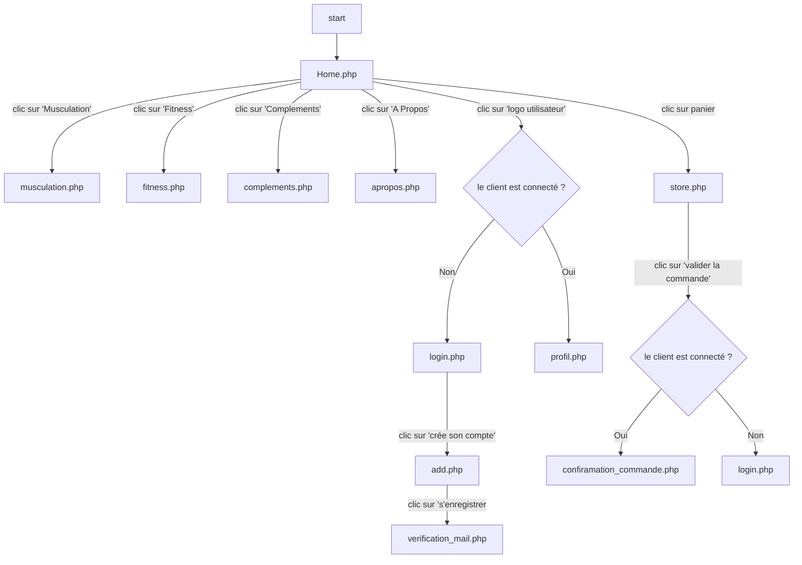

```mermaid
flowchart TD


start --> A[Home.php]
A--clic sur 'Musculation'-->B[musculation.php]
A--clic sur 'Fitness'-->D[fitness.php]

A--clic sur 'Complements'-->E[complements.php]
A--clic sur 'A Propos'-->F[apropos.php]
A--clic sur 'logo utilisateur'-->J{le client est connecté ?}
J--Non-->H[login.php]
H--clic sur 'crée son compte'-->I[add.php]
I--clic sur 's'enregistrer-->P[verification_mail.php]
J--Oui-->K[profil.php]
A--clic sur panier-->L[store.php]
L--clic sur 'valider la commande'-->M{le client est connecté ?}
M--Oui-->O[confiramation_commande.php]
M--Non-->N[login.php]
```
